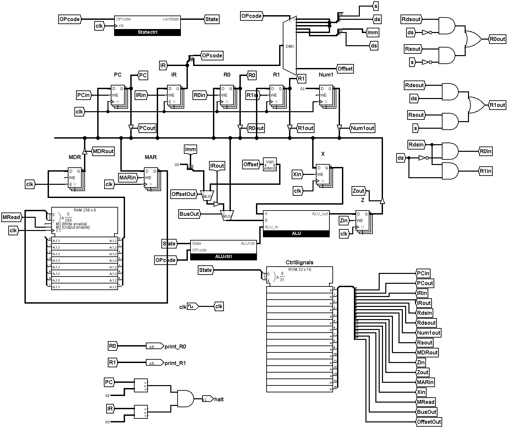

# 8-Bit-CPU-Design

Generic 8-bit CPU implemented in Logisim.
The machine has 3 different instruction formats, and the ALU can perform 4 functions.

## Instruction Formats

| A-type | Opcode |  ds  |   s   | extra  |
| ------ | ------ | ---- | ----- | ------ |
| &nbsp; | 7-4   |  3  |   2  | 1-0   |

| B-type | Opcode |  ds  |   Immediate   |
| ------ | ------ | ---- |  ------------ |
| &nbsp; | 7-4    |  3   |     2-0       |

| C-type | Opcode |  Offset   |
| ------ | ------ | --------- |
| &nbsp; | 7-4    |   3-0     |

## ALU Functions

| Operation | ALU0 | ALU1 |
| --------- | ---- | ---- |
| Add       |   1  |   1  |
| Sub       |   1  |   0  |
| Mult      |   0  |   1  |
| Nand      |   0  |   0  |


## Instruction Definitions
| Instruction Format | Opcode | Operation |
|--------------------|--------|-----------|
| nand               | 0000   | rds=~(rds & rs) |
| add                | 0001   | rds=rds+rs |
| addm               | 0010   | rds=rds+mem[rs] |
| addi               | 0011   | rds=rds+imm |
| sub                | 0100   | rds=rds-rs |
| jmp                | 1111   | PC=PC+offset (offset is sign extended) |


## RAM contents in assembly format
```
addi r0, 5      ; R0 = 5                                              ; 0011 0101
addi r1, 7      ; R1 = 7                                              ; 0011 1111
add r0, r1      ; R0 = R0 + R1 = 12                                   ; 0001 0100
sub r1, r0      ; R1 = R1 - R0 = -5                                   ; 0100 1000
addi r0, 4      ; R0 = R0 + 4 = 16                                    ; 0011 0100
addm r1, r0     ; R1 = R1 + mem[R0] = -5 + mem[16] = -5 + 117 = 112   ; 0010 1000
jmp 7           ; Jump to instruction at PC + 7                       ; 1111 0111
```
