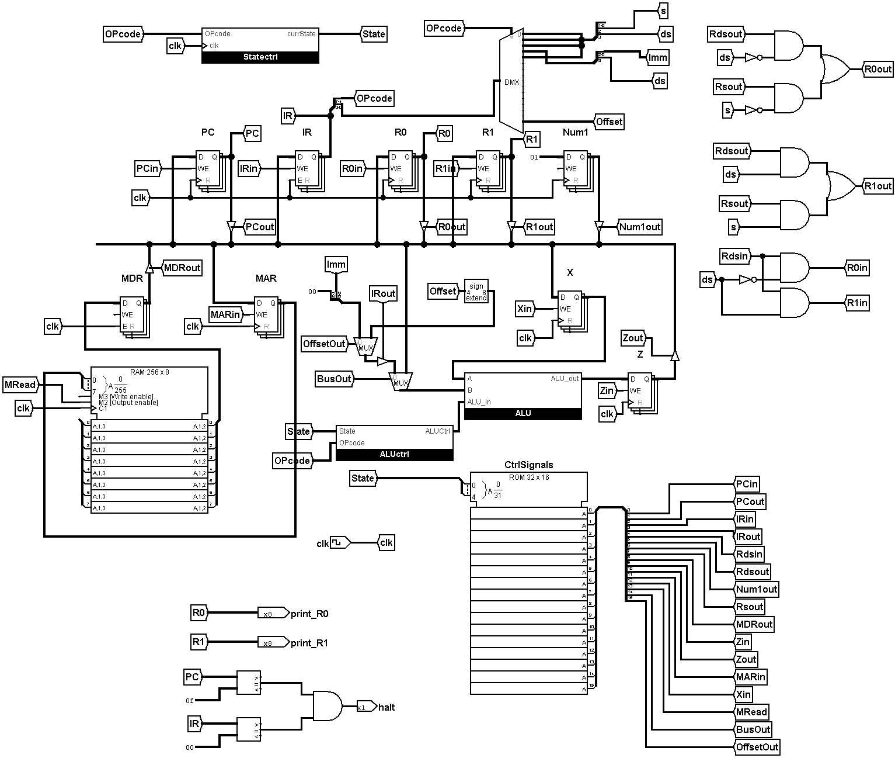

# 8-Bit-CPU-Design
Generic 8-bit CPU implemented in SystemVerilog and Logisim. The machine has 3 different instruction formats, and the ALU can perform 4 functions

## Instruction Formats

| A-type | Opcode |  ds  |   s   | extra  |
| ------ | ------ | ---- | ----- | ------ |
| &nbsp; | 7-4   |  3  |   2  | 1-0   |

| B-type | Opcode |  ds  |   Immediate   |
| ------ | ------ | ---- |  ------------ |
| &nbsp; | 7-4    |  3   |     2-0       |

| C-type | Opcode |  Offset   |
| ------ | ------ | --------- |
| &nbsp; | 7-4    |   3-0     |

## ALU Functions

| Operation | ALU0 | ALU1 |
| --------- | ---- | ---- |
| Add       |   1  |   1  |
| Sub       |   1  |   0  |
| Mult      |   0  |   1  |
| Nand      |   0  |   0  |


## SystemVerilog 
### Instructions
| Instruction Format | Opcode | Operation |
|--------------------|--------|-----------|
| nand               | 0000   | rds=~(rds & rs) |
| add                | 0001   | rds=rds+rs |
| addm               | 0010   | rds=rds+mem[rs] |
| addi               | 0011   | rds=rds+imm |
| sub                | 0100   | rds=rds-rs |
| mult               | 0101   | rds=rds*rs |
| lw                 | 0110   | rds=mem[rs] |
| sw                 | 0111   | mem[rs]=rds |
| beq                | 1000   | if (rds==rs) PC=PC+offset+1 (offset is sign extended) |
| jmp                | 1001   | PC=PC+offset+1 (offset is sign extended) |
| halt               | 1111   | stop execution |

### Test program in assembly

```
0. addi r0, 5      # r0 = 5
1. addi r1, 7      # r1 = 7
2. add  r0, r1     # r0 = r0 + r1 = 12
3. lw   r1, r0     # r1 = mem[r0] = mem[12] = 12
4. beq  1          # if (r0 == r1) skip next instruction
5. halt            # should be skipped
6. addm r0, r0     # r0 = r0 + mem[r0] = 12 + mem[12] = 24
7. addi r1, 7      # r1 = 12 + 7 = 19
8. sub  r0, r1     # r0 = r0 - r1 = 24 - 19 = 5
9. sw   r0, r1     # mem[r1] = r0 = mem[19] = 5
10. halt            # end of program
```


## Logisim 
### Instructions
| Instruction Format | Opcode | Operation |
|--------------------|--------|-----------|
| nand               | 0000   | rds=~(rds & rs) |
| add                | 0001   | rds=rds+rs |
| addm               | 0010   | rds=rds+mem[rs] |
| addi               | 0011   | rds=rds+imm |
| sub                | 0100   | rds=rds-rs |
| jmp                | 1111   | PC=PC+offset (offset is sign extended) |

### RAM contents in assembly
```
addi r0, 5      ; R0 = 5                                              ; 0011 0101
addi r1, 7      ; R1 = 7                                              ; 0011 1111
add r0, r1      ; R0 = R0 + R1 = 12                                   ; 0001 0100
sub r1, r0      ; R1 = R1 - R0 = -5                                   ; 0100 1000
addi r0, 4      ; R0 = R0 + 4 = 16                                    ; 0011 0100
addm r1, r0     ; R1 = R1 + mem[R0] = -5 + mem[16] = -5 + 117 = 112   ; 0010 1000
jmp 7           ; Jump to instruction at PC + 7                       ; 1111 0111
```

### Implementation

